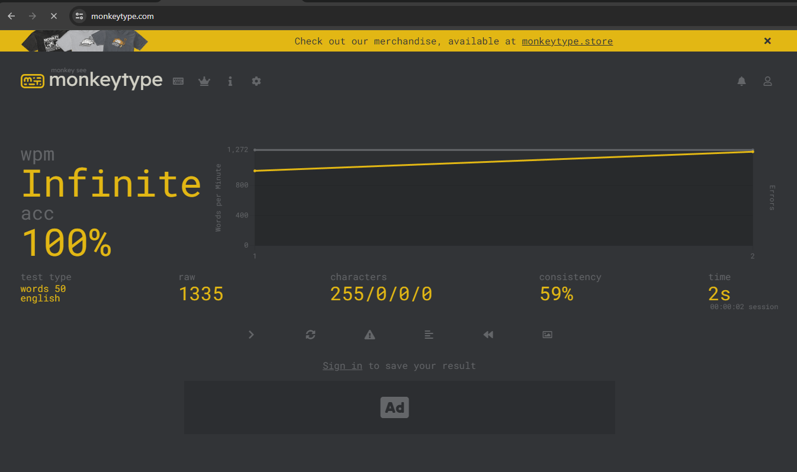

## Monkeytype Auto typing

Achieve infinite typing speed and 100% accuracy on Monkeytype with a simple automation script!



> Change the number on Line 97 in `index.ts` to control the speed of typing.

## Requirements

- Node.js (>=12.x)
- npm (>=6.x)

Steps to run it locally:
1. ```bash
    git clone https://github.com/FADHILI-Josue/monkeytype-auto-type.git
   ```

2. Run `pnpm install or npm install`
3. Run `pnpm start or npm start`

## License

- MIT

